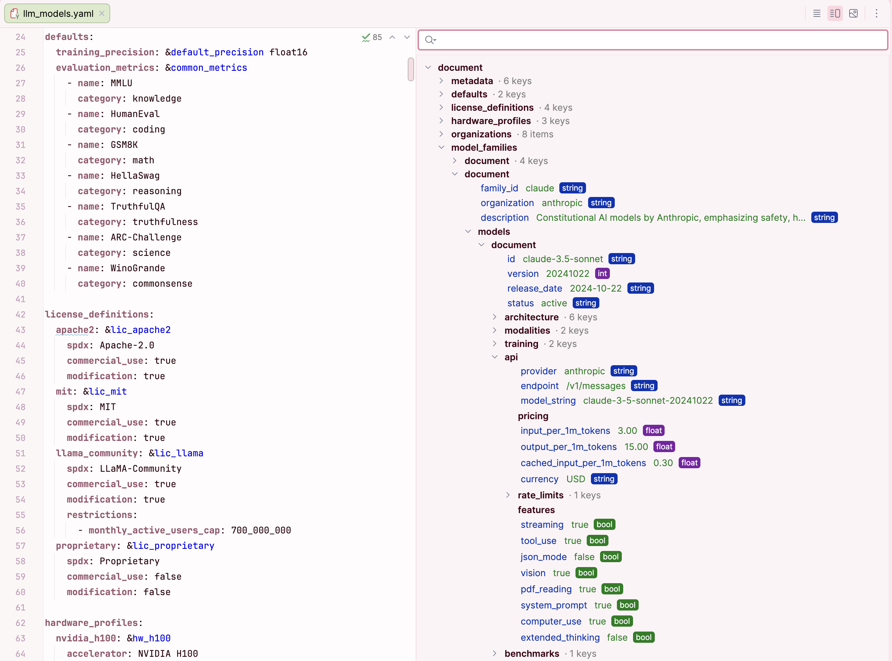

# YAML Viewer — IntelliJ IDEA Plugin

A navigable, human-readable tree/table view for any YAML file, rendered next to the raw text editor. Inspired by OpenAPI/Swagger UI, but generalized for arbitrary YAML — Kubernetes manifests, Helm charts, CI configs, application settings, anything.



## Features

- **Split editor** — raw YAML on the left, rendered tree view on the right, same as the built-in Markdown preview.
- **Hybrid tree + table rendering** — nested mappings collapse into sections; mappings of scalars render as compact key/value/type tables.
- **Type badges** — `string`, `int`, `float`, `bool`, `null` shown inline so you can spot bad values at a glance.
- **Bidirectional sync** — click a node in the tree to jump to the line in the editor; move the caret in the editor and the tree selects the matching node.
- **Search & filter** — `Cmd/Ctrl+F` focuses the filter; type to narrow the tree by key or value; `Escape` clears.
- **Breadcrumb navigation** — the current selection's full path (e.g. `spec > template > containers > [0]`) shown above the tree, each segment clickable.
- **Invalid-YAML tolerant** — keeps showing the last valid view while you're mid-edit, with a status line, instead of going blank.
- **Schema-agnostic** — no special-casing for Kubernetes, OpenAPI, or anything else. Works with any well-formed YAML.
- **Zero external dependencies** — built on IntelliJ's bundled YAML PSI.

## Install

### From JetBrains Marketplace

Install directly from the [JetBrains Marketplace listing](https://plugins.jetbrains.com/plugin/31130-yaml-viewer), or in IntelliJ IDEA: `Settings` → `Plugins` → `Marketplace` tab → search for **YAML Viewer**.

### From disk

1. Download the latest `idea-yamlviewer-<version>.zip` from the [Releases page](https://github.com/dbudyak/idea-yaml-viewer/releases), or build from source (see below).
2. In IntelliJ IDEA: `Settings` → `Plugins` → gear icon ⚙ → `Install Plugin from Disk…`
3. Select the `.zip` file and restart when prompted.

After restart, open any `.yaml` or `.yml` file — a "YAML Viewer" tab appears next to "Text" at the bottom of the editor, and the split-view toggle (`Editor` / `Split` / `Preview`) appears in the top-right corner.

## Compatibility

- IntelliJ IDEA 2024.1 (build 241) and newer — both Community and Ultimate.
- Requires the bundled YAML plugin (enabled by default).

## Build from source

```bash
git clone git@github.com:dbudyak/idea-yaml-viewer.git
cd idea-yaml-viewer
./gradlew buildPlugin
```

The distributable plugin zip is written to `build/distributions/idea-yamlviewer-<version>.zip`.

To run the plugin in a sandbox IDE for development:

```bash
./gradlew runIde
```

To run the test suite:

```bash
./gradlew test
```


## Contributing

Issues and pull requests welcome at <https://github.com/dbudyak/idea-yaml-viewer>.

## License

[MIT](LICENSE)
