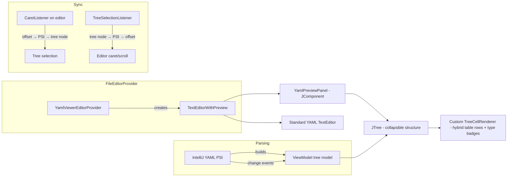

# YAML Viewer — IntelliJ IDEA Plugin Design Spec

## Overview

An IntelliJ IDEA plugin that renders YAML files as a navigable, human-readable tree/table hybrid view alongside the raw text editor. Inspired by OpenAPI/Swagger viewers but generalized to work with any YAML file.

## Goals

- Make deeply nested YAML files easy to navigate and understand
- Provide a rendered view that surfaces structure, types, and hierarchy at a glance
- Keep the raw editor accessible at all times (split view)
- Bidirectional sync between raw editor and rendered view
- Work with any YAML file — no schema-specific rendering

## Architecture

### Approach

Use IntelliJ's `TextEditorWithPreview` base class to create a split editor: standard YAML text editor on the left, custom Swing viewer panel on the right. This gives us the split editor UX for free — toggle buttons ("Editor", "Split", "Preview") and layout management are built-in. Same approach the Markdown plugin uses, but with native Swing instead of JCEF.

### Component Diagram



### Core Components

1. **`YamlViewerEditorProvider`** — `FileEditorProvider` that activates for `.yaml`/`.yml` files. Creates the `TextEditorWithPreview` instance.
2. **`YamlPreviewPanel`** — The right-side `JComponent`. Contains the search bar, breadcrumb bar, and `JTree` with custom rendering.
3. **`YamlTreeModel`** — Translates IntelliJ's YAML PSI tree into a view model suitable for the `JTree`. Each node stores its PSI element's text range for sync.
4. **`YamlTreeCellRenderer`** — Custom renderer that draws the hybrid tree+table layout: section headers for mappings, compact key/value/type rows for leaf groups.
5. **`EditorPreviewSync`** — Bidirectional sync coordinator. Listens to caret changes and tree selections, maps between them via PSI offsets.
6. **`YamlNodeType`** — Enum: `Section`, `LeafGroup`, `Sequence`, `Scalar`.
7. **`YamlScalarType`** — Enum + detection logic: `String`, `Int`, `Float`, `Bool`, `Null`.

No external dependencies — everything uses IntelliJ Platform SDK and the bundled YAML plugin's PSI.

## Viewer Panel Rendering

### Node Types

- **Section node** (mapping with children) — Bold key name, collapse arrow, child count badge when collapsed (e.g., `spec · 4 keys`). Uses `SimpleColoredComponent` with IntelliJ's standard bold attribute.

- **Leaf group node** (mapping where *every* child is a scalar — if any child is a mapping or sequence, the node is a Section instead) — Rendered as a compact table-like panel. Each row shows: key (themed foreground color), value (secondary color), type badge (small `JBLabel` with rounded background). Instead of expanding each scalar as its own tree node, the renderer packs them into a mini-table within a single tree cell.

- **Sequence node** (list) — Shows item count when collapsed. When expanded, each item is either a leaf (rendered inline with index) or a section node (if the item is a mapping).

- **Scalar node** (standalone value) — Key, value, and type badge on one line.

### Type Detection & Badges

Inferred from YAML scalar values:

| Pattern | Type | Badge Color |
|---|---|---|
| `true`/`false` | `bool` | Green |
| Numeric | `int` / `float` | Purple |
| `null`/`~`/empty | `null` | Gray |
| Everything else | `string` | Blue |

### Collapse Behavior

- Top-level keys start expanded
- Depth 2+ starts collapsed
- User expand/collapse state preserved across document edits, keyed by YAML path (e.g., `spec.template.containers[0]`)

## Bidirectional Sync

### Editor → Viewer

1. `CaretListener` fires on caret position change in the text editor
2. `PsiTreeUtil.findElementOfClassAtOffset()` finds the `YAMLKeyValue` or `YAMLSequenceItem` at the caret
3. Walk up the PSI tree to build the YAML path
4. Find the matching tree node by path, expand parents as needed, select it
5. Scroll the tree to make the selected node visible

### Viewer → Editor

1. `TreeSelectionListener` fires on tree node selection
2. The tree node holds a reference to its PSI element's text range
3. Move the editor caret to the start offset of that range
4. Scroll the editor to center the line

### Loop Prevention

A boolean guard `isSyncing`. Whichever side initiates the sync sets it to `true`, the other side's listener no-ops if set. Reset after sync completes. Both listeners run on EDT — no threading concern.

### Staleness

When the document is edited, the PSI tree changes. The tree model rebuilds on `PsiTreeChangeListener` events. During rebuild, sync is paused. After rebuild, the previously selected YAML path is re-resolved to restore selection.

## Document Change Handling

### PSI Change Listener

Register a `PsiTreeChangeListener` scoped to the current file. On any change event:

1. Debounce rapid edits — wait 300ms of inactivity before rebuilding (use `Alarm` from IntelliJ utilities)
2. Save the current YAML path of the selected tree node
3. Rebuild the `YamlTreeModel` from the updated PSI tree
4. Save and restore user expand/collapse state (keyed by YAML path)
5. Re-select the previously selected path if it still exists
6. Resume sync

### Invalid YAML Handling

When the PSI tree contains error elements (user is mid-edit, YAML temporarily broken):

- Keep displaying the last valid tree model
- Show a subtle status label at the top of the viewer panel: "YAML contains errors — showing last valid state"
- Once the PSI tree is valid again, rebuild normally

The viewer never shows a blank or partial tree while the user is typing.

## Search & Navigation

### Filter Bar

`SearchTextField` (IntelliJ's standard search component) at the top of the viewer panel. Filters the tree to show only nodes whose key or value matches the query. Non-matching branches are hidden; matching nodes keep their parent chain visible for context.

- `Cmd+F` when the viewer panel has focus activates the filter
- `Escape` clears the filter and restores the full tree

### Breadcrumb Bar

Below the search field, a path breadcrumb (e.g., `spec > template > containers > [0]`) showing the current selection's location. Each segment is clickable to jump to that ancestor. Uses `JBLabel` components with a separator.

## Plugin Structure & Build

### Build System

Gradle with IntelliJ Platform Gradle Plugin 2.x.

### Language

Kotlin.

### Target Platform

IntelliJ IDEA Community Edition 2024.1+. Depends on the bundled `org.jetbrains.plugins.yaml` plugin for PSI access.

### Source Layout

```
src/main/kotlin/com/yamlviewer/
  YamlViewerEditorProvider.kt    — FileEditorProvider, creates TextEditorWithPreview
  YamlPreviewPanel.kt            — JComponent containing the JTree
  YamlTreeModel.kt               — PSI → view model translation
  YamlTreeCellRenderer.kt        — Hybrid tree+table rendering
  EditorPreviewSync.kt           — Bidirectional sync coordinator
  YamlNodeType.kt                — Enum: Section, LeafGroup, Sequence, Scalar
  YamlScalarType.kt              — Enum + detection: String, Int, Float, Bool, Null
src/main/resources/
  META-INF/plugin.xml            — Plugin descriptor, extension registrations
```

### Extension Points

- `com.intellij.fileEditorProvider` — register `YamlViewerEditorProvider`

## Decisions Log

| Decision | Choice | Rationale |
|---|---|---|
| Viewer placement | Split editor | Natural for side-by-side comparison, matches Markdown preview UX |
| Visual style | Hybrid tree + table | Combines navigability of tree with density of tables |
| Sync | Bidirectional | Full integration between raw and rendered views |
| UI toolkit | Native Swing | Feels native in the IDE, no JCEF overhead |
| Base class | `TextEditorWithPreview` | Split editor UX for free, same pattern as Markdown plugin |
| Parsing | IntelliJ YAML PSI | No external deps, always in sync with editor content |
| Language | Kotlin | Standard for modern IntelliJ plugin dev |
| Invalid YAML | Show last valid state | Viewer stays useful during mid-edit broken states |
| Schema awareness | None (generic) | Works with any YAML file, no special-casing |
